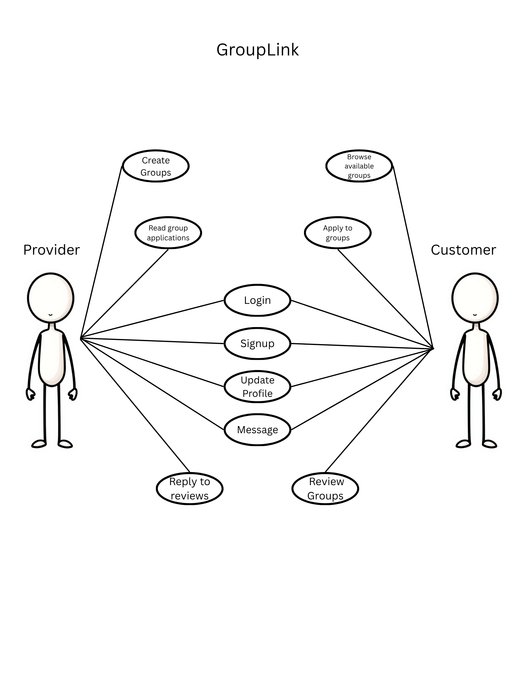
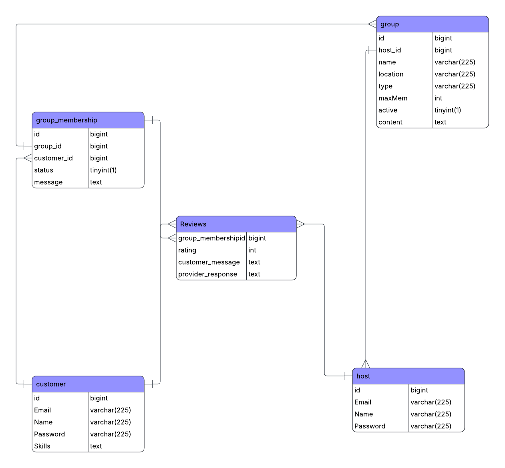

# GroupLink - Software Design 

Version 1  
Prepared by Isaiah Hames & Javier Sedano\
GroupLink\
Oct 19, 2025

Table of Contents
=================
* [Revision History](#revision-history)
* 1 [Product Overview](#1-product-overview)
* 2 [Use Cases](#2-use-cases)
  * 2.1 [Use Case Model](#21-use-case-model)
  * 2.2 [Use Case Descriptions](#22-use-case-descriptions)
    * 2.2.1 [Actor: Provider (Host)](#221-actor-provider-host)
    * 2.2.2 [Actor: Customer (Member)](#222-actor-customer-member) 
* 3 [UML Class Diagram](#3-uml-class-diagram)
* 4 [Database Schema](#4-database-schema)

## Revision History
| Name | Date    | Reason For Changes  | Version   |
| ---- | ------- | ------------------- | --------- |
|  Isaiah  |10/19     | Initial Design      |    1      |
|      |         |                     |           |
|      |         |                     |           |

## 1. Product Overview
GroupLink is a web-based application designed to help members discover and join a variety of groups. Members can browse group profiles, view open groups, apply to groups, and leave reviews based on their experience working with their group. Group leaders can manage their groups, update group descriptions and purpose, and accept or decline interested members to their group. The system supports two user roles including customers and providers; both with tailored services to ensure a vibrant, transparent, and community-driven application.

## 2. Use Cases
### 2.1 Use Case Model

### 2.2 Use Case Descriptions

#### 2.2.1 Actor: Provider (Host)
##### 2.2.1.1 Sign Up
A farmer can sign up to create their profile with their name, email, password, and phone number. Emails must be unique.
##### 2.2.1.2 Log In
A farmer shall be able to sign in using their registred email and password. After logging in, the farmer shall be directed their dashboard where they see an overview of their farm, boxes and stats.
##### 2.2.1.3 Update Profile
A farmer shall be to modify their profile by going to their profile page. They can change their email, password, and farm.
##### 2.2.1.4 Create Produce Boxes
The farmer shall be able to create a new produce box listing. They would provide a box name, description, and price. This box will be created to be associated with only this farmer and their farm.
##### 2.2.1.4 View Customer Stats
A farmer will be able to view several statistics such as total revenue, total subscribers, and average ratings.

#### 2.2.2 Actor: Customer (Member)
##### 2.2.2.1 Sign Up
A customer can sign up to create their profile with their name, email, password, and address. Emails must be unique.
##### 2.2.2.2 Log In
A customer shall be able to sign in using their registred email and password. After logging in, the customer shall be directed to the homepage where they can view all active groups.
##### 2.2.2.3 Browse Available Groups
A customer shall be able to view available groups. They can do this from the home page or using a search function. They can also filter groups by type, location, size, or name. They will also be able to select one group and view more details.
##### 2.2.1.4 Apply to Available Group
Upon selecting a group, a customer shall be able to apply to the group. This group will then appear on their as pending in their group page, and they will be able to withdraw the application if needed.
##### 2.2.1.5 Review Group
A customer may write a review for a group they have joined. They will be able to rate the group host based on kindness, effectiveness, and execution.

## 3. UML Class Diagram

## 4. Database Schema
